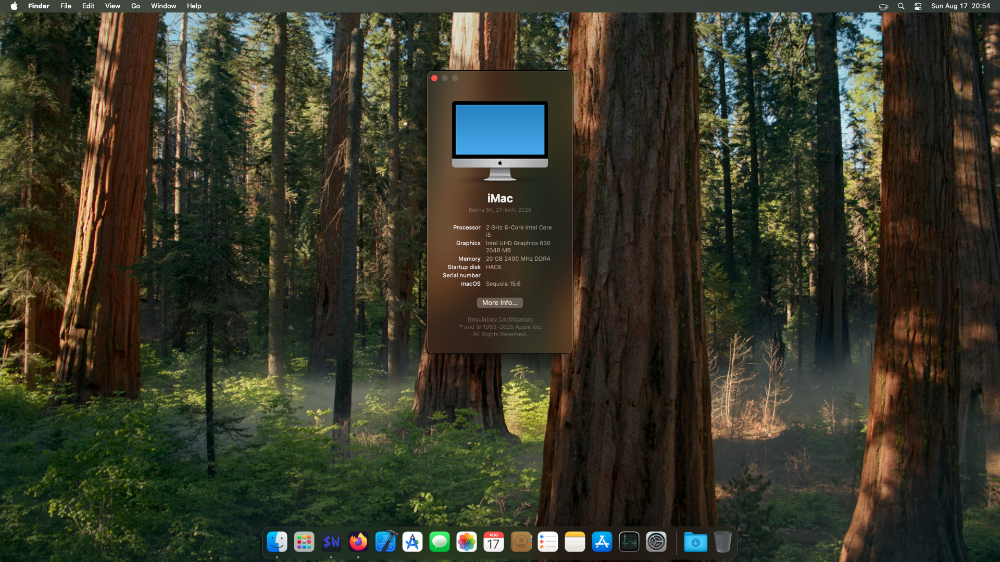

# thinkcentre-m70q-opencore
#### Opencore/Hackintosh EFI for Lenovo ThinkCentre M70q

## macOS Details
Category | Version
:- | :-
[OpenCore](https://github.com/acidanthera/OpenCorePkg) | 1.0.2
macOS | Sequoia 15.1

## Hardware Specifications
Category | Part | Status
:- | :- | :-:
Model | Lenovo ThinkCentre M70q | ✅
CPU | Intel i5-10400T | ✅
GPU | Intel UHD Graphics 630 | ✅
RAM | 20GB (16GB + 4GB) | ✅
Drive | 256GB Kingston A400 SATA Drive | ✅
Audio | Realtek ALC233 (`alcid=28`) | ✅
Ethernet | Intel I219-V | ✅

## Notes
- Use `iMac20,1` as your [SMBIOS](https;//github.com/corpnewt/GenSMBIOS).
- Special thanks to [vuongle98's](https://github.com/vuongle98/hackintosh-lenovo-m70q) EFI for the correct framebuffer patch.
